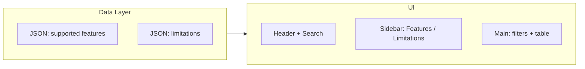

# Slack-Style Docs Viewer for Supported Features & Limitations

## Content summary (from your PDFs)

**Supported Features** (23 pages): One Time / Delta Migration, Channels (public, private, archived, mentions, members), DMs (group, 1:1, non-admin), text formatting (bold, italic, lists, code, etc.), files (all types, Canva, GIFs, stickers), replies, and related behavior.

**Limitations** (5 pages): Custom emojis/stickers/GIFs as names or links, Canva as HTML, multiple files (first as file, rest as links), no video/audio transcriptions, underline as plain text, custom reactions/saved/pinned not retained, user groups as IDs only, tagged channels as text when channel not in destination, Polly as plain text, no workflows/edited tag/forwarded metadata/self-messages.

---

## Architecture




- **Data**: Two JSON files derived from the PDFs (one for features, one for limitations), each item with `name`, `description`, and `family` (category) for filtering.
- **UI**: Single-page app with Slack-docs-style layout; sidebar switches between “Supported Features” and “Limitations”; main area shows search, family filters, and table.

---

## Tech approach

- **Stack**: Static site (no backend). Options:
  - **Option A (recommended)**: HTML + CSS + vanilla JS — fast to build, easy to host (e.g. GitHub Pages, internal server).
  - **Option B**: React or Next.js — if you prefer a component framework and may extend later.
- **Hosting**: Any static host (e.g. `documentation` folder served as-is, or export to `dist/`).

---

## Data model

Each list item (feature or limitation):


| Field         | Purpose                                                       |
| ------------- | ------------------------------------------------------------- |
| `name`        | Short identifier (e.g. "One Time Migration", "Custom Emojis") |
| `description` | 1–2 sentence summary                                          |
| `family`      | Category for filter tags (e.g. "Channels", "Files", "Emojis") |


**Supported features** — families could be: Migration, Channels, Direct Messages, Text Formatting, Files, etc.

**Limitations** — families could be: Emojis & Media, Files, Transcriptions, Formatting, Reactions, User Groups, Channels, Workflows, etc.

You will get two JSON files: `data/supported-features.json` and `data/limitations.json`, populated from the PDF content.

---

## UI structure (Slack-docs-style)

1. **Header**
  - Logo/title (e.g. "Slack to Chat Docs").
  - Nav: "Supported Features" | "Limitations" (or "Reference" with these as sections).
  - Global search (e.g. Ctrl+K) scoped to current list.
  - Optional: theme toggle (dark by default to match reference).
2. **Left sidebar**
  - Section title: "Reference" (or "Docs").
  - Two main items: **Supported Features** (with optional sub-items like Overview, or categories), **Limitations**.
  - Expand/collapse; current section highlighted.
  - Collapsible sidebar (double-chevron) for more space.
3. **Main content**
  - Page title: "Supported Features" or "Limitations".
  - Search: "Search by name or description!" (scoped to current list).
  - **Filter tags**: "All" + one tag per `family` (e.g. Channels, Files, DMs, Emojis). Click to filter table.
  - **Table**: Columns **Name** (link or plain), **Description**, **Family** (tag). Row per item; horizontal dividers.
4. **Styling**
  - Dark theme (dark grey background, light text).
  - Active filter: light blue; table row hover; green or accent for names if they’re links.

---

## File layout (Option A — static)

```
documentation/
├── index.html              # Single page; sidebar + main content
├── css/
│   └── styles.css          # Slack-docs-like dark theme, layout, table
├── js/
│   └── app.js              # Load JSON, render sidebar, filters, table; search
└── data/
    ├── supported-features.json
    └── limitations.json
```

No build step; open `index.html` or serve the folder.

---

## Implementation steps

1. **Extract and normalize data**
  From both PDFs, create `supported-features.json` and `limitations.json` with `name`, `description`, `family` for each entry. Group features into families (Channels, DMs, Formatting, Files, etc.) and limitations similarly (Emojis & Media, Files, Transcriptions, etc.).
2. **Markup and layout**
  Build `index.html` with header, sidebar, and main area (search, filter bar, table placeholder). Use semantic structure (nav, main, section) for accessibility.
3. **Styling**
  Implement `styles.css`: dark theme, responsive sidebar (collapsible), filter tags, table with dividers and hover, active states for nav and filters.
4. **Behavior**
  In `app.js`: load both JSON files; render sidebar (Supported Features / Limitations); on section change, show the right list; build filter tags from `family`; render table; wire search (by name + description) and filter (by family); optional keyboard shortcut (e.g. Ctrl+K) for search focus.
5. **Polish**
  Ensure search and filters work together (e.g. filter by family then search within result); optional “clear filters”; basic responsive behavior for smaller screens.

---

## Demo mockup

A mockup image is generated and saved in the workspace to show the intended layout: dark header and sidebar, "Supported Features" selected, filter tags (All, Channels, DMs, Files, …), and a table with sample rows (Name, Description, Family). You can use it to align the build with the Slack API docs look.

---

## Decisions to confirm

- **Option A (HTML/CSS/JS)** vs **Option B (React/Next.js)** — recommend A unless you need a framework.
- **Data**: Should we add extra fields later (e.g. “Backlog”, “Screenshot link”) or keep only name/description/family for v1?
- **Navigation**: Single page with two sections (Supported Features | Limitations) is enough for the “two lists” requirement; we can add more sections later if you add more docs.

Once you confirm the tech choice and data scope, implementation can follow this plan and the demo image for visual reference.